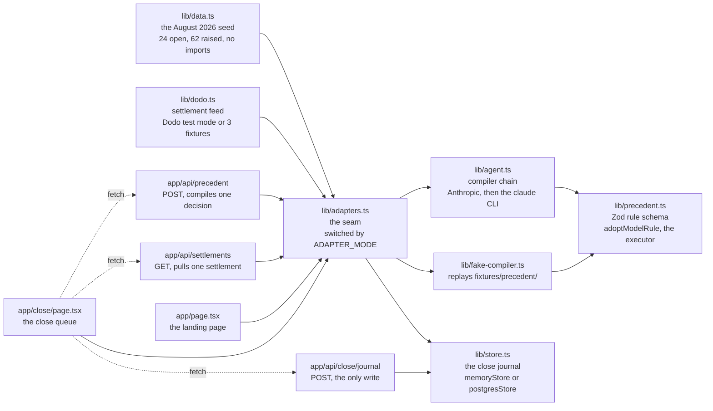

# Obiter

**The controller resolves one reconciliation exception. Obiter compiles that decision into a named rule and closes every matching exception in the queue, with the precedent stamped on each record and one click to take it all back.**

## Deployed addresses

| What | Where |
| --- | --- |
| Live app | https://obiter-app.vercel.app |
| Demo start route | https://obiter-app.vercel.app/close |
| Measured result panel | https://obiter-app.vercel.app/close#measures |
| Repository | https://github.com/mericcintosun/obiter |
| Demo video | `<ADD_VIDEO_URL>` |

There is no `contracts/` directory, no chain and no wallet in this repo, so there
is no contract address row and no on-chain smoke script. The close journal is the
only mutable state Obiter has, and `npm run demo:reset` puts it back.

Built for **Syndicate by Maximor**, Track 2, Autonomous Office of the CFO.
Licensed under [MIT](LICENSE).

`ADAPTER_MODE` decides which compiler runs behind `lib/adapters.ts`. It defaults to `fake`, which compiles the precedent from the checked-in answers in `fixtures/precedent/` with no API key and no network, so the whole demo path is clickable on a laptop with no accounts. Set `ADAPTER_MODE=real` to run the live Claude chain in `lib/agent.ts` instead. Both modes hand their answer to the same Zod validation in `lib/precedent.ts`, so the offline path exercises the guard rail rather than skipping it.

## The problem

At month-end close, the easy 90 percent of reconciliation matches itself. The pain is in the residue: underpayments, currency moves between the invoice date and the settlement date, one bank transfer covering three invoices, money that lands two days after the cutoff, a fee charged twice, a payment referencing a purchase order instead of an invoice.

A controller works through those by hand. At a company of 10 to 50 people that is one person, and at an accounting firm it is the close team. The problem is not that the work is hard. It is that last month's reasoning was never written down anywhere a machine could read it, so when the same customer underpays by the same euro next month, the same line lands back in the queue and gets the same thirty seconds of thought.

The seeded close in this repo is a fair example. 220 bank lines against 210 invoices for August 2026. The matcher raised 62 exceptions. Rules written in June and July closed 38 of them before anyone opened the screen, a 61 percent autonomy rate. 24 are left, spread across six patterns.

## The solution

Obiter is two layers.

**A deterministic matching engine.** Anything it cannot clear becomes a structured exception record: pattern, counterparty and counterparty group, shortfall in amount and percent, days between due date and settlement, the evidence it collected, and the reason it escalated instead of deciding.

**A precedent compiler on top of it.** When the controller resolves one exception, the decision does not become free text and it does not become a model weight. It becomes a typed JSON rule: conditions, tolerance, scope, action, and a written reason. A language model writes that rule exactly once. From then on the rule runs in a deterministic executor, so the same queue always produces the same closures and no model call sits between a record and its outcome.

Three things follow from that shape:

1. **Retroactive application.** The rule runs against the open queue immediately. Before it does, you see exactly which exceptions it will touch, by id.
2. **Provenance.** Every closed record carries the id of the precedent that closed it.
3. **Reversal.** Reverting a precedent returns every record it ever touched to the open queue in one pass.

### The precedent object

This is the whole thing. There is no hidden state.

```json
{
  "id": "PREC-03",
  "name": "Rounding shortfall up to $2.00, Northwind Group",
  "kind": "short_payment",
  "conditions": {
    "maxAbsDelta": 2,
    "maxDeltaPct": 0.5,
    "maxDaysApart": 2,
    "currencies": ["USD"],
    "requireBatchSumMatch": false
  },
  "scope": { "level": "counterparty_group", "value": "Northwind Group" },
  "action": "close_as_rounding",
  "rationale": "This group converts EUR at their own bank and lands a euro or two short. Seen 3 times in the last 6 closes, never disputed.",
  "authoredBy": "Dana Rowe, controller",
  "compiledFrom": "EXC-0142",
  "compiledAt": "2026-08-31T18:04:11.220Z"
}
```

It is validated with Zod before it is allowed near the queue. A rule that tries to widen its own scope past what the controller chose, or change the pattern it applies to, is rejected outright rather than patched.

## Measured result on the seeded close

| | Before | After three decisions |
| --- | --- | --- |
| Open exceptions needing a human | 24 | 0 across three patterns, 11 in the remaining three |
| Records closed with no human looking at them | 38 of 62 | 51 of 62 |
| Autonomy | 61 percent | 82 percent |
| Human touches | 24 | 3 |

Clearing all six patterns takes it to 56 of 62, which is 90 percent, on six human touches. Every number on the close screen is computed from the seed at render time, not hardcoded, so you can check it by counting rows.

The same four numbers render live at `/close#measures`, computed from the close journal at render time, so the table above can be checked against the screen while the demo is running.

## How it uses the required and sponsor technology

### The prize rows this submission is entered for

One Devpost project, one track. These three rows all ride the same Track 2 submission, so none of them is a separate integration to build.

| Bounty | Prize | Slots | Required tech | Code file | DEMO step |
| --- | --- | --- | --- | --- | --- |
| `Track 2 - 1st Place - Cash Prize by Maximor` | `$1,000 in cash` | 1 | `AO (Agent Orchestrator)` | `lib/precedent.ts` | 3 |
| `Track 2 - 1st Place - Dodo Payments Credits` | `$1,000 in credits` | 1 | `AO (Agent Orchestrator)` | `lib/dodo.ts` | 6 |
| `Track 2 - 2nd Place - Dodo Payments Credits` | `$500 in credits` | 1 | `AO (Agent Orchestrator)` | `lib/dodo.ts` | 6 |

> "AO usage is mandatory for eligibility and will be verified through the submission and demo"
>
> "Each project may enter only one track"

This project entered Track 2, Autonomous Office of the CFO, and no Track 1 row is claimed.

**AO (Agent Orchestrator), the eligibility requirement.** The build ran as an orchestrator session with the work split across worker sessions: matching engine, precedent compiler, close interface, and seed pipeline. The session count and the PR summaries are on screen in the demo video, because the rules page asks for exactly that.

**Claude.** `lib/agent.ts` calls Claude with the precedent JSON schema as a tool definition, so the compiler is a structured-output call rather than prose parsing. It runs once per decision. The model id defaults to `claude-opus-5`.

**Dodo Payments, test mode.** `lib/dodo.ts` reads recent settlements and turns each into an exception the same engine reasons about. A payment that arrives while the period is still open goes through the same matcher, and if an active precedent covers it, it closes with no person involved. Without a key the same shape comes from three local fixtures.

### The compiler fallback chain

With `ADAPTER_MODE=real`, `compilePrecedent` in `lib/agent.ts` tries four paths in order:

1. Claude via the Anthropic API, when `ANTHROPIC_API_KEY` is set. **This is the path the recorded demo must run on.**
2. Your local `claude` CLI, detected once with `claude --version` and invoked with `claude -p --output-format text --model haiku`. This exists so a developer gets the real agent loop with zero keys and zero cost. It is skipped on Vercel, where the binary is not installed.
3. The recorded answer in `fixtures/precedent/`, replayed through `lib/fake-compiler.ts`.
4. The deterministic draft in `lib/precedent.ts`, built from the controller's own inputs.

With `ADAPTER_MODE` unset or `fake`, `lib/fake-compiler.ts` runs on its own: it replays a recorded `emit_precedent` answer from `fixtures/precedent/`, and falls to the same deterministic draft when no fixture covers the record on the desk.

Every one of those paths goes through the same Zod schema and the same `adoptModelRule` guard. Output that fails it is discarded and the caller moves on, which is why a bad generation, and equally a stale fixture, cannot reach the queue. The prompt the real path sends is written out in `prompts/precedent-compiler.md`.

### What keeps the demo on the rails

Three bounds, all in the real path, all there because the recording is the deliverable.

**The compile step has a six second budget.** `COMPILE_TIMEOUT_MS` is 6000 and `COMPILE_RETRIES` is 0, both in `lib/config.ts`. The demo contract allows the compile five seconds of feel, so the model gets six and then loses its turn. A retry would double the worst case, and the next compiler in the chain is a better use of the seventh second than a second attempt at the same call.

**The fixture is a rung in the real chain, not only the fake one.** When the provider times out or answers with a 500 mid-recording, the chain lands on the checked-in `emit_precedent` answer, which goes through the same `adoptModelRule` guard a live answer does. So an outage yields "PREC-03: Rounding shortfall up to $2.00, Northwind Group", the rule the demo script quotes, instead of a differently named deterministic draft. The draft is still there underneath, for a pattern no fixture was recorded for.

**The settlement feed picks money that can actually close.** `fetchLatestSettlement` in `lib/dodo.ts` asks Dodo for a page of ten succeeded payments rather than the single newest one, and `pickSettlement` walks the ones `usableForDemo` accepts: an invoice number that is not an `INV-UNMAPPED` placeholder, and a positive shortfall, because a payment that is not short cannot demonstrate a precedent closing it. A second and third pull return different money. When the page holds nothing usable, the fixture in the same file answers and one line goes to the server log saying so.

## Architecture

Every box below is a file in this repo. The seam in the middle is the only thing
a page or a route is allowed to talk to, which is what makes the offline path and
the live path the same code with a different answer behind it.



Two rules hold that graph together. `lib/precedent.ts` is the only place a rule
is validated, so the live model answer, the replayed fixture and the
deterministic draft all pass through the same `adoptModelRule` guard. And
`lib/store.ts`, `lib/agent.ts`, `lib/db/*` and `lib/config.ts` are never imported
by a page or a `"use client"` file: every consumer reaches them through
`lib/adapters.ts` or an API route.

## Tech stack

Next.js 15 App Router, TypeScript in strict mode, Tailwind CSS v4, shadcn primitives, Zod for rule validation and at every route edge, Drizzle over Postgres on Neon for the close ledger, Claude for the one compilation step, Dodo Payments test mode for the settlement feed, Vitest for the pinned demo test, deployed on Vercel.

[`SECURITY.md`](SECURITY.md) is the other half of that list: what the app holds, every credential and outbound call it makes, what each endpoint can write or spend, and where to send a report. There is no wallet and no chain in this repo.

## Quickstart

```bash
npm install
npm run dev
```

The deployed app is at https://obiter-app.vercel.app and the demo starts at https://obiter-app.vercel.app/close, which is the route DEMO.md step 1 opens on; the landing page at `/` is context for a reader, not part of the recorded flow.

Open http://localhost:3000 and click through to the close queue. Nothing else is required: `ADAPTER_MODE` is `fake` unless you say otherwise, so the compiler replays `fixtures/precedent/` and the settlement feed serves the three fixtures in `lib/dodo.ts`. No key, no network, no local `claude` binary.

To run the real model path:

```bash
cp .env.example .env.local
# set ADAPTER_MODE=real and fill in ANTHROPIC_API_KEY
# add DATABASE_URL for a close that survives a reload, then npm run db:push
# add DODO_PAYMENTS_API_KEY for the live settlement feed
npm run dev
```

```bash
npm test           # vitest, run once
npm run seed       # writes fixtures/close-august-2026.json from lib/data.ts
npm run db:push    # applies drizzle/0000_init.sql to DATABASE_URL
npm run db:seed    # clears the journal for OBITER_CLOSE_ID, back to the baseline
npm run demo:reset # puts the demo back at 24 open exceptions and 61 percent
```

`npm run demo:reset` is the one to run between takes. With `DATABASE_URL` set it deletes the closures, the pulled settlements and the precedents for this close id and prints the counts. Without one it says so and tells you the reset is a dev server restart or the "Reset the close" button, then prints the state the close screen should show either way. There is no chain in this repo and no on-chain fixture, so the close journal is the only mutable state there is to put back.

**Persistence needs three things and none of them are required to run the app.** Put a Neon pooled connection string in `.env.local` as `DATABASE_URL`, with `?sslmode=require` on the end; run `npm run db:push` once to create the three tables in `drizzle/0000_init.sql`; run `npm run db:seed` whenever you want the close back at its August 2026 baseline.

With no `DATABASE_URL`, the close journal lives in the in-process store in `lib/store.ts`. That survives navigation and reloads inside one running server and resets when the process does, which is enough for a local walkthrough and not enough for a deployed one.

`npm test` runs the two suites in `tests/`. The one that matters is the demo invariant: PREC-03, compiled from EXC-0142 at a $2.00 tolerance, closes exactly `EXC-0142, EXC-0144, EXC-0149, EXC-0151, EXC-0158, EXC-0163, EXC-0166`, pinned by id. If that fails, the recording is wrong.

`npm run seed` reads the close out of `lib/data.ts` and writes `fixtures/close-august-2026.json`: the summary, the two carried precedents, and all 24 open exceptions, keys in a fixed order. It carries no timestamps and no random values, so two runs on a clean checkout produce a byte-identical file and any diff on it is a real change to the seed. It then prints the counts it wrote (exceptions, distinct patterns, carried precedents, autonomy percent) so you can check them against the close screen. The seed is never written into the database: `lib/data.ts` is the baseline every close starts from, and the tables hold only what the controller did on top of it.

### Try the loop in 60 seconds

1. Open `/close`. 24 exceptions, autonomy at 61 percent.
2. Click **EXC-0142**, a $1.65 shortfall from Northwind Freight BV. Read what the engine collected and why it refused to decide.
3. Leave the defaults (close as rounding, tolerance $2.00, this counterparty group) and press **Compile a precedent**.
4. PREC-03 appears with its conditions and a line saying it will close 7 open exceptions, listed by id. Press **Apply**.
5. Seven rows close, each stamped PREC-03. Autonomy moves.
6. Click any PREC-03 stamp, then **Revert this precedent**. All seven return to the queue.
7. Press **Pull latest settlement**. New money arrives, matches PREC-03, and closes with no human involved.
8. Refresh the browser. With a `DATABASE_URL` set, the seven rows are still closed, the seal is still stamped on each, the meter still reads 71 percent, and the settlement is still there.

## What we would build next

- Signed Dodo webhooks with `standardwebhooks` so settlements push instead of being pulled.
- A precedent conflict check: warn when a new rule overlaps an existing one, and show which one wins.
- Per-precedent hit rate over time, so a rule that starts closing things it should not is visible before an auditor finds it.
- Export the precedent set as a reviewable diff for the auditor, which is the artifact an accounting firm would actually want.

## AI use, and the eligibility requirement behind it

The rules page states two things this section answers directly:

> "AO usage is mandatory for eligibility and will be verified through the submission and demo"

> "Each project may enter only one track"

**This project entered Track 2, Autonomous Office of the CFO, and claims no Track 1 row.**

**AO (Agent Orchestrator) during the build.** The work ran as an orchestrator
session with the matching engine, the precedent compiler, the close interface and
the seed pipeline each split into their own worker session. That is a process
fact, not a runtime dependency: there is no AO API call anywhere in this
repository, and the proof the rules page asks for is the AO dashboard with the
total session count on screen in the demo video, which is shot 2 in
[`docs/VIDEO.md`](docs/VIDEO.md). Do not describe an AO call on camera, because
there is not one.

**AI assistants during the build.** AI coding assistants were used throughout,
for scaffolding, for boilerplate and for drafting. Architecture, product
decisions and the final read of the code are ours, and the commit history is
granular on purpose because the rules allow organisers to inspect it.

**Claude at runtime.** The product calls Claude at exactly one point: the
precedent compiler in `lib/agent.ts`, once per controller decision, with the
precedent JSON schema handed over as a tool definition. Nothing else in the
running app calls a model. Every closure after that compile is executed by the
deterministic matcher in `lib/precedent.ts`, which is why the same queue always
produces the same result.

This repository is MIT licensed. See [`LICENSE`](LICENSE).

## Team

`<ADD_TEAM_MEMBER_NAMES>`
